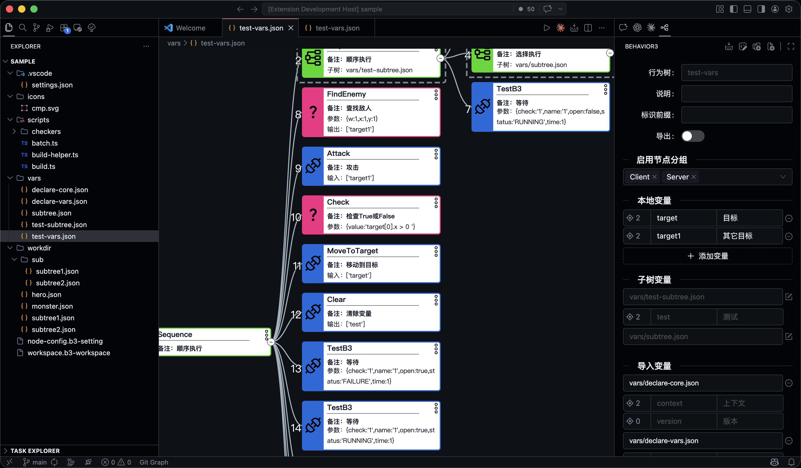

# Behavior3 Editor

VS Code custom editor for Behavior3 JSON behavior trees. It combines a visual graph canvas, an Inspector, project scaffolding, and build/check/batch scripting for game AI workflows.

## Related Projects

- **[behavior3-ts](https://github.com/codetypess/behavior3-ts)** - TypeScript runtime library
- **[behavior3lua](https://github.com/zhandouxiaojiji/behavior3lua)** - Lua runtime

## Preview



## Features

- Visual graph editor for Behavior3 trees and reachable subtrees
- Inspector in `sidebar` or `embedded` mode
- Explorer `Behavior3` submenu for project, tree, and script scaffolding
- Build, debug build, checker scripts, and project batch processing
- Custom node definitions via `.b3-setting`
- Expression and node-argument validation
- Theme-aware UI for dark and light VS Code themes

## Quick Start

### Open a tree

- Right-click a Behavior3 `.json` file in Explorer
- Select **Open With** -> **Behavior3 Editor**

### Create project files

From a folder's Explorer `Behavior3` submenu you can run:

- **Create Project**
- **Create Behavior Tree File**
- **Create Build Script**
- **Create Batch Script**
- **Create Checker Script**
- **Run Script as Batch Process**

`Run Script as Batch Process` is also available on `.ts`, `.mts`, `.js`, and `.mjs` files. Running it from a folder lets you choose a script first; running it from a script file runs that script directly.

### Configure node definitions

Create a `.b3-setting` file in the workspace:

```json
[
  {
    "name": "MyAction",
    "type": "Action",
    "desc": "Does something useful",
    "args": [{ "name": "duration", "type": "float", "desc": "Duration in seconds" }]
  },
  {
    "name": "CheckScore",
    "type": "Condition",
    "desc": "Checks whether the score matches the rule",
    "args": [{ "name": "value", "type": "expr", "desc": "Expression" }]
  }
]
```

### Configure workspace behavior

Use a `.b3-workspace` file to register build and checker scripts:

```json
{
  "settings": {
    "checkExpr": true,
    "buildScript": "scripts/build.ts",
    "checkScripts": ["scripts/checkers/**/*.ts"]
  }
}
```

`buildScript` and `checkScripts` are resolved relative to the `.b3-workspace` file. See [sample/workspace.b3-workspace](sample/workspace.b3-workspace) for a complete sample.

## Inspector Modes

Set `behavior3.inspectorMode` to choose the active Inspector presentation:

- `sidebar`: show the Inspector in the dedicated Behavior3 side view
- `embedded`: show the Inspector inside the main editor webview

Both modes share the same document semantics and commands. Only the presentation changes.

## Build, Batch, and Check Scripts

Behavior3 supports ESM JavaScript and TypeScript scripts:

- JavaScript: `.js`, `.mjs`
- TypeScript: `.ts`, `.mts` (runtime transpile, no type-check)

When importing local TypeScript helpers, use explicit extensions such as `./helper.ts`.
The `behavior3` decorator namespace is provided by the runtime, so script files only need type imports from `vscode-behavior3/build`.

All script types can import authoring types from `vscode-behavior3/build`. Example scripts are available in:

- [sample/scripts/build.ts](sample/scripts/build.ts)
- [sample/scripts/batch.ts](sample/scripts/batch.ts)
- [sample/scripts/checkers/positive.ts](sample/scripts/checkers/positive.ts)

### Build Scripts

Build scripts are declared with `@behavior3.build` and can transform build output without rewriting source trees.

```ts
import type { BuildEnv, BuildScript } from "vscode-behavior3/build";

@behavior3.build
export class ProjectBuild implements BuildScript {
  constructor(private readonly env: BuildEnv) {}
}
```

Supported hooks:

- `onProcessTree(tree, path, errors)`
- `onProcessNode(node, errors)`
- `onWriteFile(path, tree)`
- `onComplete(status)`

### Batch Scripts

Batch scripts are declared with `@behavior3.batch` and are used by **Run Script as Batch Process** to rewrite source trees in place across the current project.

Supported hooks:

- `shouldUpgradeTree(path, tree)`
- `onProcessTree(tree, path, errors)`
- `onProcessNode(node, errors)`
- `onWriteFile(path, tree)`
- `onComplete(status)`

### Checker Scripts

Checker scripts register custom argument validators with `@behavior3.check("name")`. They are used by both Inspector validation and project builds.

For compatibility, supported script files may still export classes through named `Hook`, `BuildHook`, `BatchHook`, or `default`, but the decorator-based forms above are the canonical APIs.

## Build and Debug

- Click **Build** in the editor title bar, or press `Ctrl/Cmd+B`
- Press `Ctrl/Cmd+Shift+B` to start a debug build session

The npm package also exposes a `behavior3-build` command for CI and project scripts:

```bash
npm install -D vscode-behavior3
```

```json
{
  "scripts": {
    "build:behavior": "behavior3-build --project ./workdir/hero.json --output ./dist/behavior3"
  }
}
```

You can also run it directly:

```bash
npm exec -- behavior3-build --project ./workdir/hero.json --output ./dist/behavior3
```

Or without installing first:

```bash
npx --package vscode-behavior3 behavior3-build --project ./workdir/hero.json --output ./dist/behavior3
```

## Extension Settings

| Setting                     | Type      | Default     | Description                                                              |
| --------------------------- | --------- | ----------- | ------------------------------------------------------------------------ |
| `behavior3.checkExpr`       | `boolean` | `true`      | Enable expression validation for expression-type args.                   |
| `behavior3.language`        | `string`  | `"auto"`    | UI language: `auto`, `zh`, or `en`.                                      |
| `behavior3.subtreeEditable` | `boolean` | `true`      | Allow editing supported subtree content from the current editor context. |
| `behavior3.inspectorMode`   | `string`  | `"sidebar"` | Choose whether the Inspector is shown in `sidebar` or `embedded` mode.   |

## Keyboard Shortcuts

| Key                      | Action                         |
| ------------------------ | ------------------------------ |
| `Ctrl/Cmd+Z`             | Undo                           |
| `Ctrl+Y` / `Cmd+Shift+Z` | Redo                           |
| `Ctrl/Cmd+C`             | Copy node                      |
| `Ctrl/Cmd+V`             | Paste node                     |
| `Ctrl/Cmd+Shift+V`       | Replace node                   |
| `Enter` / `Insert`       | Insert node                    |
| `Delete` / `Backspace`   | Delete selected node           |
| `Ctrl/Cmd+F`             | Search node content            |
| `Ctrl/Cmd+G`             | Jump to node by id             |
| `Ctrl/Cmd+B`             | Build                          |
| `F4`                     | Toggle Text / Behavior3 editor |

## Docs

- [docs/README.md](docs/README.md) - documentation entry point
- [docs/spec-driven-development.md](docs/spec-driven-development.md) - SDD workflow
- [docs/spec/README.md](docs/spec/README.md) - baseline spec map and work-item index
- [sample/](sample) - sample workspace, trees, and scripts

## Development

- Output logs: **View -> Output** -> **Behavior3**
- Webview logs are also available in DevTools

## Requirements

- VS Code `^1.105.0`
- Node `>=20.19` for the CLI and TypeScript script runtime

## License

MIT
